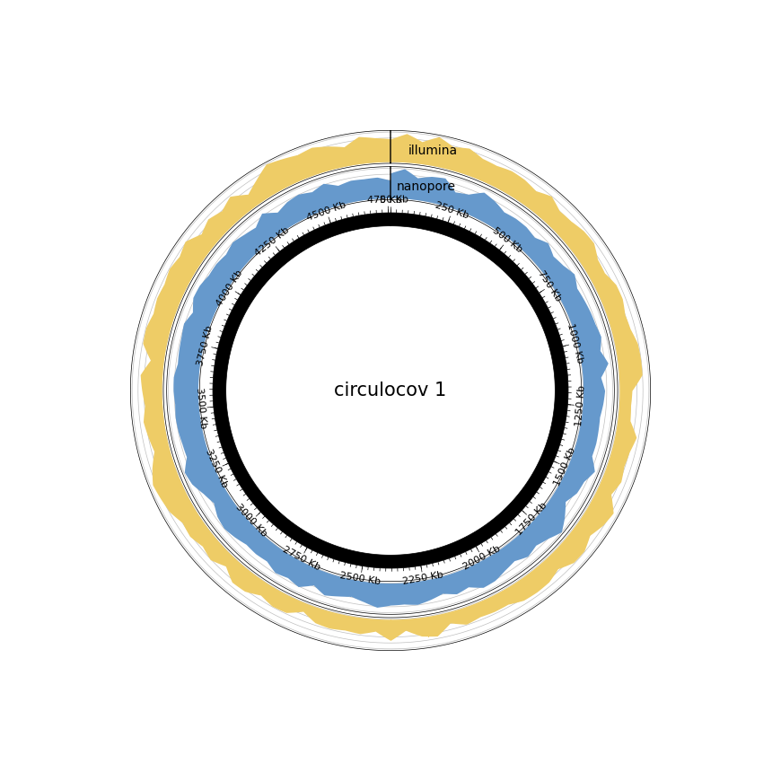
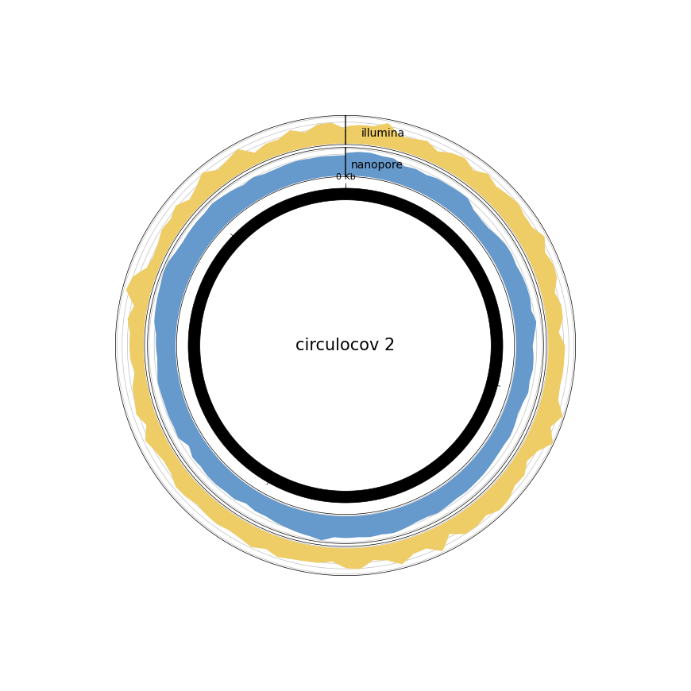
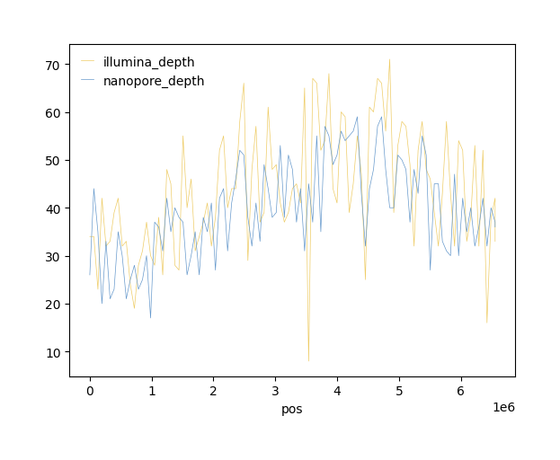

# CirculoCov

Circular-Aware Coverage for Draft Genomes

## Overview
CirculoCov is a Python tool designed for circular-aware coverage analysis of draft genomes. Alignment is difficult at the beginning and end of linear sequences, so coverage is lower at these positions than the true value. CirculoCov "pads" these sequences by adding the initial portions of the reference to the end. 

## Circular determination
Draft genomes are input as fasta files, which are not inherently circular. Instead, there must be a "Circular=True" or something similar in the header of the fasta file.

Strings that will indicate a sequence is circular (case insensitive):
- circular=true
- circ=true
- circular=t
- circ=t
- complete sequence

This tool is designed to 
1. take a draft genome and determine which sequences are circular
2. map nanopore\ONT, Illumina, and/or Pacbio reads to the draft genome with minimap2
3. get coverage information with pysam
4. get depth information with pysam (optional: set with `--all` or `-a`)
5. extract fastq files for each contig (optional: set with `--all` or `-a`)
6. visualize depth for circular and linear sequences (optional: set with `--all` or `-a`)
7. create a tab-delimited summary

## Requirements
- Python 3.11+
- [minimap2](https://github.com/lh3/minimap2)
- [pysam](https://pysam.readthedocs.io/en/latest/api.html)
- [biopython](https://biopython.org/)
- [pyCirclize](https://github.com/moshi4/pyCirclize)

## Installation
```
# circulcov and its python dependencies can be installed via pip
pip install circulocov

# minimap2 is not installed via pip
MINIMAP2_VER="2.26"
curl -L https://github.com/lh3/minimap2/releases/download/v${MINIMAP2_VER}/minimap2-${MINIMAP2_VER}_x64-linux.tar.bz2 | tar -jxvf -
```

NOTE: minimap2 must be in PATH

## Usage
```
circulocov -g draft_genome.fasta -n nanopore.fastq.gz -i illumina1.fastq.gz illumina2.fastq.gz -o out
```

```
usage: circulocov [-h] [-s SAMPLE] -g GENOME [-i ILLUMINA [ILLUMINA ...]] [-n NANOPORE] [-p PACBIO] [-a | --all | --no-all] [-d PADDING] [-w WINDOW] [-o OUT] [-log LOGLEVEL] [-t THREADS] [-v]

options:
  -h, --help            show this help message and exit
  -s SAMPLE, --sample SAMPLE
                        Sample name
  -g GENOME, --genome GENOME
                        Genome (draft or complete)
  -i ILLUMINA [ILLUMINA ...], --illumina ILLUMINA [ILLUMINA ...]
                        Input illumina fastq(s)
  -n NANOPORE, --nanopore NANOPORE
                        Input nanopore fastq
  -p PACBIO, --pacbio PACBIO
                        Input pacbio fastq
  -a, --all, --no-all
  -d PADDING, --padding PADDING
                        Amount of padding added to circular sequences
  -w WINDOW, --window WINDOW
                        Number of windows for coverage
  -o OUT, --out OUT     Result directory
  -log LOGLEVEL, --loglevel LOGLEVEL
                        Logging level
  -t THREADS, --threads THREADS
                        Number of threads to use
  -v, --version         Print version and exit

```

## Output
The output is
- A csv file with each contig broken into windows with their corresponding depths for Illumina and nanopore files
- png files showing depth

Final directory tree:
```
circulocov/
├── circulocov_contig.png
├── circulocov.map-ont.bam
├── circulocov.map-ont.bam.bai
├── circulocov.sr.bam
├── circulocov.sr.bam.bai
├── cov.txt
├── depth.txt
├── fastq
│   ├── circulocov_contig_illumina_R1.fastq.gz
│   ├── circulocov_contig_illumina_R2.fastq.gz
│   ├── circulocov_contig_illumina_singletons.fastq.gz
│   ├── circulocov_contig_nanopore.fastq.gz
│   ├── circulocov_unmapped_illumina_R1.fastq.gz
│   ├── circulocov_unmapped_illumina_R2.fastq.gz
│   ├── circulocov_unmapped_illumina_singletons.fastq.gz
│   └── circulocov_unmapped_nanopore.fastq.gz
├── illumina_cov.txt
├── illumina_full_depth.txt
├── illumina_window_depth.txt
├── nanopore_cov.txt
├── nanopore_full_depth.txt
├── nanopore_window_depth.txt
└── overall_summary.txt
```

## Examples
### Example circular images
Chromosome

Plasmid


### Example linear image


### Example overall_summary.txt
```
sample	circ	contigs	length	nanopore_numreads	nanopore_covbases	nanopore_coverage	nanopore_meandepth	illumina_numreads	illumina_covbases	illumina_coverage	illumina_meandepth
circulocov	X	all	4848601	76429	4871275	100.0	108.89	1357369	4871172	100.0	65.4
circulocov	True	1	4760004	73319	4770005	100.0	109.19	1322860	4769959	100.0	65.75
circulocov	True	2	85925	1593	95926	100.0	73.32	14025	95873	99.94	34.92
circulocov	True	3	2672	1397	5344	100.0	479.55	6624	5340	99.93	301.94
circulocov	X	missing	1	60	0	0.0	0.0	6930	0	0.0	0.0
```

This overall summary is to provide context to how well the assembled genome is supported by the reads. Contigs with _few_ reads are not-as-likely to be real. Assemblies with _large numbers_ of unmapped reads may have contamination or other issues that need to be addressed. 

Note: "few" and "large numbers" are not defined in this README.md and are intentionally left to interpretation.

## Notes:

- Although the examples have both Nanopore/ONT and Illumina reads, only one type of read is required.

- There are not currently ways to adjust the image generated. Instead, the depth and coverage files are available as input for other tools and scripts for visualization.

- The term 'windows' may be a misleading in the case of CirculoCov. In CirculoCov, 'windows' are more like snapshots accross the genome at specific positions where the number of positions is equal to 'windows'. These snapshots, however, are very similar to a sliding window, but take less computation.

- The 'coverage' values are determined on padded lengths. The default padding length is 10,000 and should have minimal impact on the overall coverage of a large sequence, such as that of a chromosome of a bacterial isolate. 

- The overall coverage value is the weighted average (weighted by sequence length) of the coverage values of each contig and is not a "true" mean depth value. It's pretty close, though, and for most intents and purposes fulfills depth determination goals.

- Although the intention was for circular draft genomes that were generated from long-read sequencing, Circulocov can also be run on short-read draft genomes. I can't stop you.

The overall_summary.txt looks like the following for some Illumina reads and a draft genome generated via [SPADES]()
```
sample	circ	contigs	length	illumina_numreads	illumina_covbases	illumina_coverage	illumina_meandepth
circulocov	X	all	1896302	667346	1896302	100.0	58.08
circulocov	False	NODE_1_length_301278_cov_13.884221	301278	102826	301278	100.0	57.4
circulocov	False	NODE_2_length_260824_cov_14.255592	260824	91352	260824	100.0	58.89
circulocov	False	NODE_3_length_246348_cov_13.065149	246348	77949	246348	100.0	53.34
circulocov	False	NODE_4_length_162631_cov_14.077740	162631	56509	162631	100.0	58.38
circulocov	False	NODE_5_length_104704_cov_13.520325	104704	35033	104704	100.0	56.06
circulocov	False	NODE_6_length_103452_cov_13.112896	103452	32850	103452	100.0	53.65
circulocov	False	NODE_7_length_102202_cov_13.434240	102202	33342	102202	100.0	55.05
circulocov	False	NODE_8_length_98819_cov_14.561201	98819	35921	98819	100.0	60.96
circulocov	False	NODE_9_length_80890_cov_13.799413	80890	27469	80890	100.0	57.01
circulocov	False	NODE_10_length_79994_cov_14.554259	79994	28576	79994	100.0	60.19
circulocov	False	NODE_11_length_69572_cov_13.453251	69572	22580	69572	100.0	54.84
circulocov	False	NODE_12_length_63941_cov_13.388097	63941	20889	63941	100.0	54.81
circulocov	False	NODE_13_length_56590_cov_14.060730	56590	19114	56590	100.0	56.79
circulocov	False	NODE_14_length_50417_cov_14.307357	50417	17643	50417	100.0	58.8
circulocov	False	NODE_15_length_35637_cov_14.605435	35637	12615	35637	100.0	59.8
circulocov	False	NODE_16_length_20076_cov_14.072986	20076	6802	20076	100.0	57.25
circulocov	False	NODE_17_length_16587_cov_14.497752	16587	5902	16587	100.0	59.84
circulocov	False	NODE_18_length_6839_cov_29.648987	6839	4802	6839	100.0	118.0
circulocov	False	NODE_19_length_6131_cov_13.328115	6131	2054	6131	100.0	55.35
circulocov	False	NODE_20_length_4963_cov_12.199338	4963	1453	4963	100.0	49.51
circulocov	False	NODE_21_length_4942_cov_96.471859	4942	11643	4942	100.0	401.67
circulocov	False	NODE_22_length_3986_cov_13.249806	3986	1314	3986	100.0	55.55
circulocov	False	NODE_23_length_2041_cov_24.901776	2041	1158	2041	100.0	95.38
circulocov	False	NODE_24_length_1247_cov_29.244643	1247	948	1247	100.0	125.44
circulocov	False	NODE_25_length_965_cov_16.443914	965	305	965	100.0	54.15
circulocov	False	NODE_26_length_962_cov_15.434731	962	329	962	100.0	56.27
circulocov	False	NODE_27_length_732_cov_31.732231	732	434	732	100.0	100.47
circulocov	False	NODE_28_length_501_cov_16.959893	501	187	501	100.0	63.03
circulocov	False	NODE_29_length_443_cov_13.629747	443	114	443	100.0	42.23
circulocov	False	NODE_30_length_403_cov_15.452899	403	103	403	100.0	41.09
circulocov	False	NODE_31_length_383_cov_11.621094	383	62	383	100.0	27.0
circulocov	False	NODE_32_length_375_cov_13.310484	375	67	375	100.0	30.36
circulocov	False	NODE_33_length_363_cov_0.563559	363	402	363	100.0	170.91
circulocov	False	NODE_34_length_340_cov_15.399061	340	78	340	100.0	36.89
circulocov	False	NODE_35_length_340_cov_10.126761	340	60	340	100.0	26.72
circulocov	False	NODE_36_length_331_cov_14.504902	331	108	331	100.0	49.04
circulocov	False	NODE_37_length_316_cov_31.185185	316	121	316	100.0	65.71
circulocov	False	NODE_38_length_295_cov_20.023810	295	68	295	100.0	39.09
circulocov	False	NODE_39_length_295_cov_12.702381	295	51	295	100.0	27.64
circulocov	False	NODE_40_length_288_cov_13.559006	288	54	288	100.0	28.49
circulocov	False	NODE_41_length_282_cov_11.703226	282	58	282	100.0	29.43
circulocov	False	NODE_42_length_281_cov_20.909091	281	112	281	100.0	64.77
circulocov	False	NODE_43_length_270_cov_24.825175	270	108	270	100.0	64.33
circulocov	False	NODE_44_length_268_cov_16.836879	268	39	268	100.0	26.41
circulocov	False	NODE_45_length_265_cov_10.971014	265	67	265	100.0	38.41
circulocov	False	NODE_46_length_260_cov_64.278195	260	218	260	100.0	132.45
circulocov	False	NODE_47_length_259_cov_8.166667	259	61	259	100.0	37.09
circulocov	False	NODE_48_length_258_cov_19.068702	258	63	258	100.0	38.5
circulocov	False	NODE_49_length_255_cov_47.062500	255	130	255	100.0	68.07
circulocov	False	NODE_50_length_255_cov_21.648438	255	56	255	100.0	36.76
circulocov	False	NODE_51_length_255_cov_18.570312	255	58	255	100.0	36.95
circulocov	False	NODE_52_length_255_cov_17.562500	255	52	255	100.0	33.66
circulocov	False	NODE_53_length_255_cov_16.445312	255	46	255	100.0	31.01
circulocov	False	NODE_54_length_255_cov_15.085938	255	50	255	100.0	32.72
circulocov	False	NODE_55_length_255_cov_13.078125	255	18	255	100.0	11.14
circulocov	False	NODE_56_length_246_cov_38.378151	246	101	246	100.0	68.65
circulocov	False	NODE_57_length_203_cov_25.157895	203	55	203	100.0	42.99
circulocov	False	NODE_58_length_180_cov_32.867925	180	39	180	100.0	31.25
circulocov	False	NODE_59_length_174_cov_24.829787	174	40	174	100.0	34.55
circulocov	False	NODE_60_length_128_cov_4.000000	128	8	128	100.0	6.08
circulocov	X	missing	1	6340	0	0.0	0.0
```

